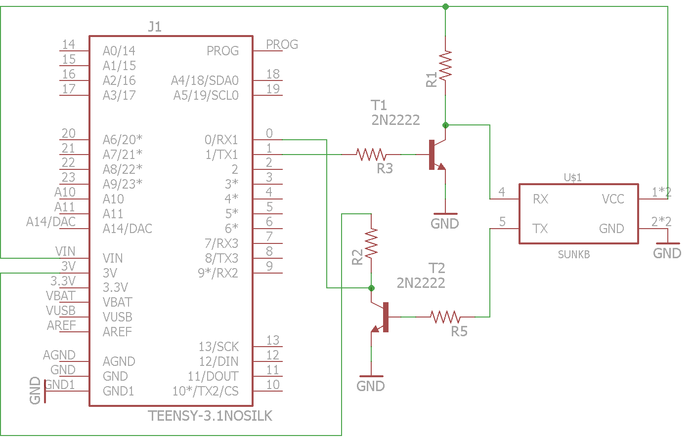
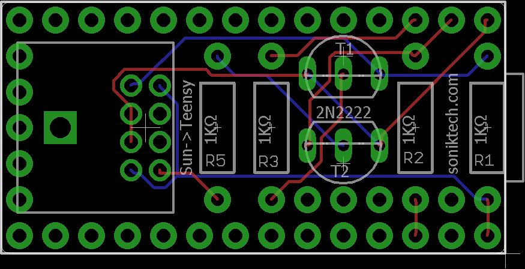

# sun2usb
An Adapter to connect your Classic keyboard to a modern interface

Met a cool guy in Pittsburgh who asked about retrofitting a couple of keyboards his school was throwing away to work with modern hardware. I got to keep one of the keyboards :)

It's a fun piece of desk history and definitely feels more solid than most keyboards.

